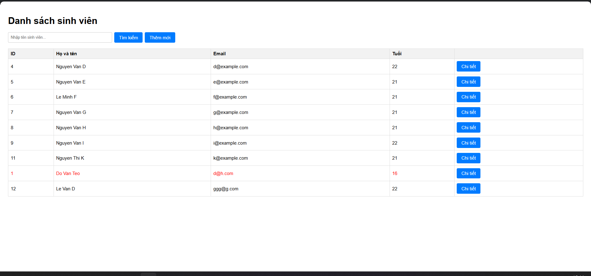
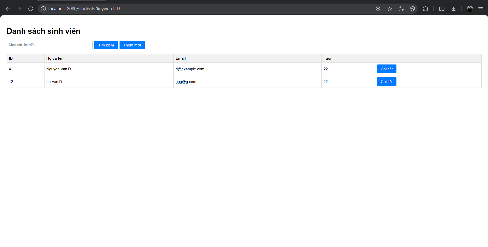
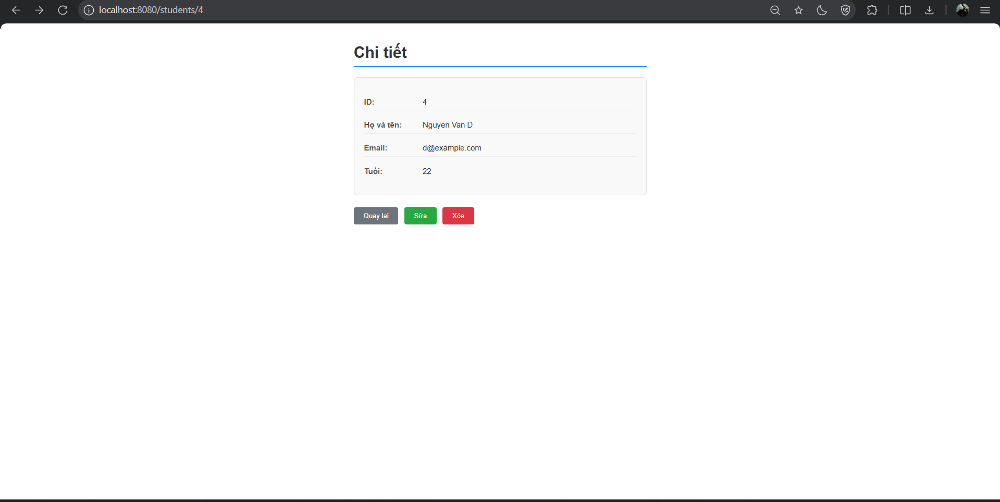
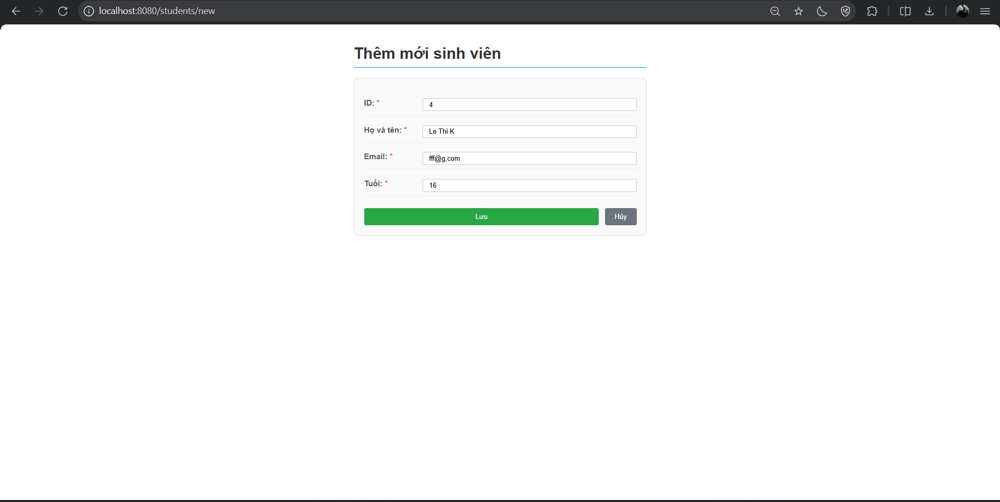
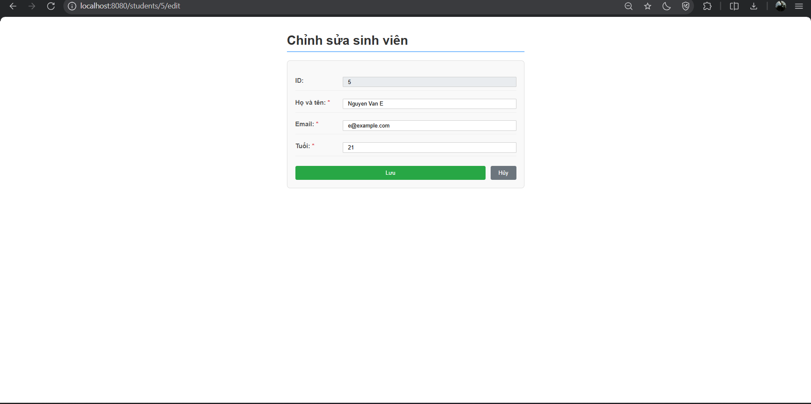

# Lab: Xây Dựng Web App Căn Bản
Sinh viên thực hiện: Lê Hoàng Tiến - 2213455
Public URL: https://student-management-goa3.onrender.com

## 1. Hướng dẫn chạy dự án:

### Yêu cầu cài đặt trước (Prerequisites)
Đảm bảo máy tính đã cài đặt các phần mềm sau:
- **Git** – [Tải tại đây](https://git-scm.com/downloads)
- **Docker Desktop** – [Tải tại đây](https://www.docker.com/products/docker-desktop/)

> 💡 Sau khi cài Docker Desktop, hãy mở ứng dụng và đợi cho đến khi biểu tượng Docker ở thanh taskbar chuyển sang trạng thái **Running** trước khi thực hiện các bước tiếp theo.
### Bước 1: Clone dự án từ GitHub
Mở **Terminal** (hoặc **Command Prompt** / **PowerShell** trên Windows), chạy lệnh sau:
```bash
git clone https://github.com/mrpranksta/adsoftweng.git
```
### Bước 2: Di chuyển vào thư mục dự án
### Bước 2.1: Thêm các biến môi trường (tùy chọn)
Trong phạm vi bài lab, các thông tin biến môi trường được thiết lập sẵn. Có thể thiết lập lại thông tin trên bằng việc tạo file .env trong thư mục dự án, định dạng:
```
DATABASE_URL= 
DB_USERNAME= 
DB_PASSWORD= 
PORT= 
```
### Bước 3: Khởi chạy dự án bằng Docker Compose
```bash
docker compose up
```
> ⏳ Lần chạy đầu tiên có thể mất vài phút để Docker tải các image cần thiết và build ứng dụng. Hãy đợi cho đến khi thấy log hiển thị thông báo ứng dụng đã khởi động thành công.
> 💡 Nếu muốn chạy ở chế độ nền (background), thêm cờ `-d`:
> ```bash
> docker compose up -d
> ```
### Bước 4: Truy cập ứng dụng
Mở trình duyệt web (Chrome, Firefox, Edge,...) và truy cập:
| Trang | URL |
|-------|-----|
| 🖥️ Giao diện Frontend | [http://localhost:8080/students](http://localhost:8080/students) |
| 🔌 API Backend | [http://localhost:8080/api/students](http://localhost:8080/api/students) |
### Dừng dự án
Khi muốn tắt ứng dụng, quay lại Terminal và nhấn `Ctrl + C`, sau đó chạy:
```bash
docker compose down
```
### Xử lý lỗi thường gặp
| Lỗi | Nguyên nhân | Cách khắc phục |
|-----|-------------|----------------|
| `docker: command not found` | Chưa cài Docker hoặc Docker chưa chạy | Cài Docker Desktop và đảm bảo đã khởi động |
| `port 8080 is already in use` | Cổng 8080 đang bị ứng dụng khác chiếm | Tắt ứng dụng đang dùng cổng 8080 hoặc đổi port trong file `docker-compose.yml` |
| `git: command not found` | Chưa cài Git | Tải và cài đặt Git từ [git-scm.com](https://git-scm.com/downloads) |


## 2. Các giao diện:


<p style="text-align:center;">Trang danh sách sinh viên</p>


<p style="text-align:center;">Thực hiện tìm kiếm, ví dụ tìm người có tên là "D"</p>


<p style="text-align:center;">Trang chi tiết</p>


<p style="text-align:center;">Hiển thị yêu cầu xác nhận trước khi xóa</p>


<p style="text-align:center;">Trang thêm sinh viên</p>


<p style="text-align:center;">Trang chỉnh sửa</p>

## 3. Trả lời câu hỏi:
**Câu 1:**  Cố tình Insert một sinh viên có `id` trùng với một người đã có sẵn. Quan sát thông báo lỗi: `UNIQUE constraint failed`. Tại sao Database lại chặn thao tác này?
**Trả lời:**
*Do `id` là khóa chính (primary key), không cho phép giá trị trùng lặp nên ta không thể thêm sinh viên mới có `id` trùng với một người đã có trong database.

**Câu 2:** Thử Insert một sinh viên nhưng bỏ trống cột `name` (để NULL). Database có báo lỗi không? Từ đó suy nghĩ xem sự thiếu chặt chẽ này ảnh hưởng gì khi code Java đọc dữ liệu lên?
**Trả lời:**
Database không báo lỗi. Khi code Java đọc dữ liệu trên, `name` nhận giá trị `null`. Sự thiếu chặt chẽ này dẫn đến:
    * Phát sinh yêu cầu xử lý / kiểm tra trường hợp NullPointerException khi đọc dữ liệu từ bảng, khiến code rườm rà hơn. Nếu không xử lý sẽ phát sinh lỗi.
    * Chức năng thực hiện trên dữ liệu này ảnh hưởng tính đảm bảo (reliability) như hiển thị bảng, tìm kiếm, lọc thông tin,...

