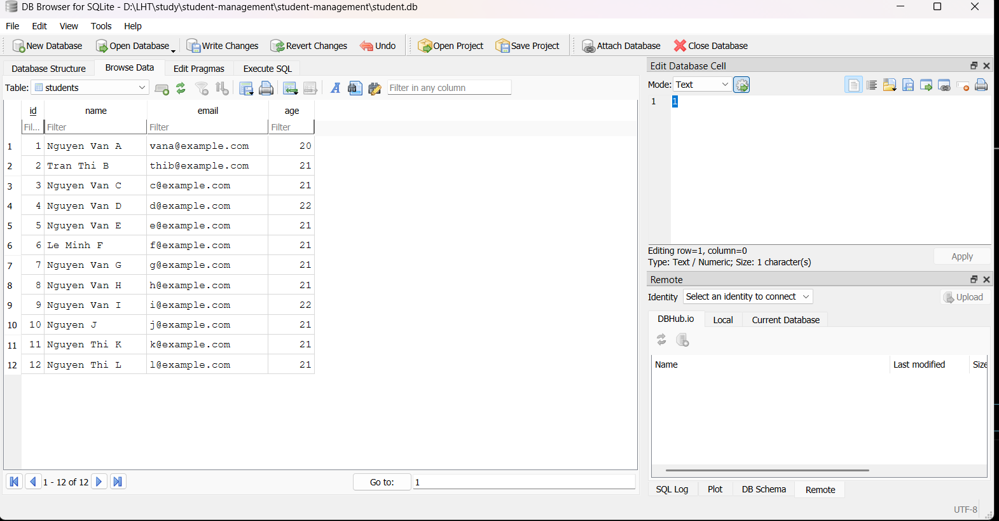

# Phần trả lời câu hỏi bài tập các Lab

## 1. Lab 1
### 1.  Dữ liệu lớn: 
Hãy thử thêm ít nhất **10 sinh viên** nữa.

```
INSERT INTO students (id, name, email, age) VALUES (3, 'Nguyen Van C', 'c@example.com', 21);
INSERT INTO students (id, name, email, age) VALUES (4, 'Nguyen Van D', 'd@example.com', 22);
INSERT INTO students (id, name, email, age) VALUES (5, 'Nguyen Van E', 'e@example.com', 21);
INSERT INTO students (id, name, email, age) VALUES (6, 'Le Minh F', 'f@example.com', 21);
INSERT INTO students (id, name, email, age) VALUES (7, 'Nguyen Van G', 'g@example.com', 21);
INSERT INTO students (id, name, email, age) VALUES (8, 'Nguyen Van H', 'h@example.com', 21);
INSERT INTO students (id, name, email, age) VALUES (9, 'Nguyen Van I', 'i@example.com', 22);
INSERT INTO students (id, name, email, age) VALUES (10, 'Nguyen J', 'j@example.com', 21);
INSERT INTO students (id, name, email, age) VALUES (11, 'Nguyen Thi K', 'k@example.com', 21);
INSERT INTO students (id, name, email, age) VALUES (12, 'Nguyen Thi L', 'l@example.com', 21);
```
**Kết quả:**


### 2.  Ràng buộc Khóa Chính (Primary Key):
    *   Cố tình Insert một sinh viên có `id` trùng với một người đã có sẵn.
    *   Quan sát thông báo lỗi: `UNIQUE constraint failed`. Tại sao Database lại chặn thao tác này?
    **Trả lời:**
    *Do `id` là khóa chính (primary key), không cho phép giá trị trùng lặp nên ta không thể thêm sinh viên mới có `id` trùng với một người đã có trong database.

### 3.  Toàn vẹn dữ liệu (Constraints):
    *   Thử Insert một sinh viên nhưng bỏ trống cột `name` (để NULL).
    *   Database có báo lỗi không? Từ đó suy nghĩ xem sự thiếu chặt chẽ này ảnh hưởng gì khi code Java đọc dữ liệu lên?
    **Trả lời:**
    Database không báo lỗi. Khi code Java đọc dữ liệu trên, `name` nhận giá trị `null`. Sự thiếu chặt chẽ này dẫn đến:
    * Phát sinh xử lý / kiểm tra trường hợp NullPointerException khi đọc dữ liệu từ bảng, khiến code rườm rà hơn. Nếu không xử lý kỹ sẽ dẫn đến sập.
    * Chức năng cần đọc dữ liệu này ảnh hưởng tính đảm bảo (reliability) như hiển thị bảng, tìm kiếm.

    
    
